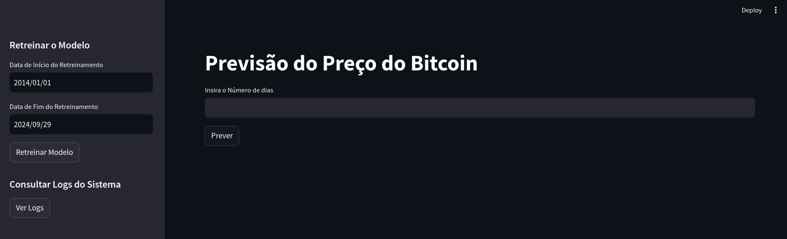
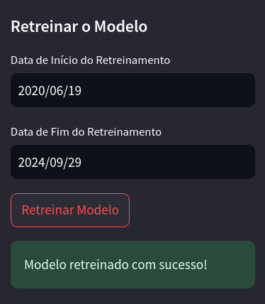
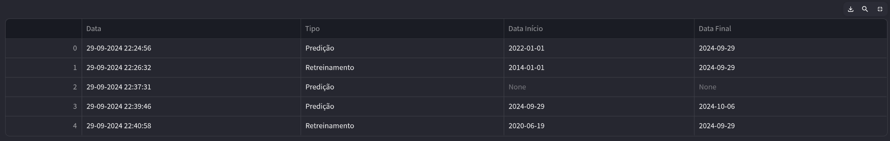
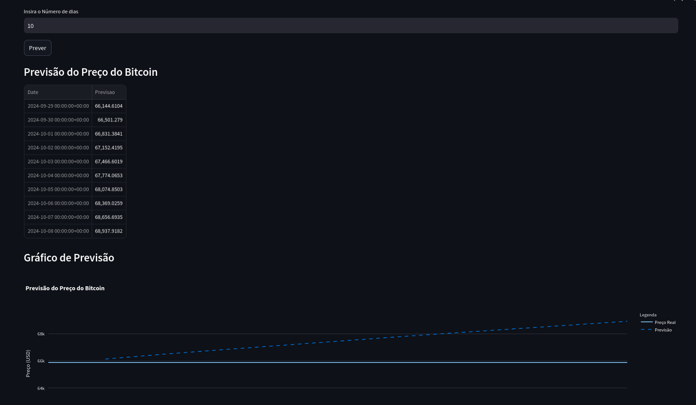

# Previsão do Preço do Bitcoin

Este projeto fornece um sistema para prever o preço do Bitcoin utilizando um modelo GRU treinado. A solução consiste em uma API desenvolvida com FastAPI para fornecer previsões e um sistema de logging para monitoramento, além de um frontend interativo feito em Streamlit.

Toda a parte de análise de dados está documentada no notebook [bitcoin.ipynb](./treinamento/bitcoin.ipynb).

## Índice

- [Instalação](#instalação)
  - [Pré-requisitos](#pré-requisitos)
  - [Passos para Instalação](#passos-para-instalação)
- [Visão Geral da Solução](#visão-geral-da-solução)
  - [API (FastAPI)](#api-fastapi)
  - [Sistema de Logging](#sistema-de-logging)
  - [Frontend (Streamlit)](#frontend-streamlit)
- [Como Utilizar](#como-utilizar)

## Instalação

### Pré-requisitos

Antes de iniciar, é necessário garantir que Docker e Docker Compose estejam instalados no sistema.

- **Docker**: Para instalar o Docker, siga as instruções oficiais: [Guia de Instalação do Docker](https://docs.docker.com/get-docker/)
- **Docker Compose**: Para instalar o Docker Compose, siga as instruções oficiais: [Guia de Instalação do Docker Compose](https://docs.docker.com/compose/install/)

### Passos para Instalação

1. Clone o repositório:

   ```bash
   git clone https://github.com/pedrocruz2/crypto-learning/
   cd crypto-learning
   ```

2. Construa e inicie os containers Docker utilizando o Docker Compose:

   ```bash
   docker-compose up --build
   ```

   Isso iniciará os serviços para a API FastAPI e para o frontend Streamlit.

3. Acesse o frontend na URL:

   ```
   http://localhost:8501
   ```

   A API estará disponível em:

   ```
   http://localhost:8000
   ```

## Visão Geral da Solução

Este sistema é composto por três componentes principais:

- **API (FastAPI)**
- **Sistema de Logging**
- **Frontend (Streamlit)**

### API (FastAPI)

A API é responsável por fornecer previsões sobre o preço do Bitcoin e por permitir o retreinamento do modelo. Ela contém os seguintes endpoints:

- **`/predict/`** (POST): Este endpoint permite que o usuário forneça um período (`period`), em dias, para obter uma previsão futura do preço do Bitcoin. A API retorna as previsões com base em um modelo GRU pré-treinado.
- **`/retrain/`** (POST): Este endpoint é usado para retreinar o modelo. O usuário fornece uma data de início e uma data de fim, e a API usa esses dados para coletar informações históricas do Bitcoin e retreinar o modelo, substituindo o antigo.
- **`/model_usage_logs/`** (GET): Este endpoint retorna os logs de uso do sistema, que incluem tanto previsões quanto retreinamentos realizados.

### Sistema de Logging

Cada vez que um endpoint `/predict/` ou `/retrain/` é chamado, o sistema registra a ocorrência em um banco de dados SQLite, que armazena os seguintes dados:

- **Tipo de Ocorrência**: `"Predição"` ou `"Retreinamento"`.
- **Data e Hora**: A data e hora em que a solicitação foi realizada.
- **Data Início** e **Data Final**: Para previsões, a data de início é a data atual e a data final é a data atual mais o período especificado. Para o retreinamento, são usadas as datas fornecidas pelo usuário.

Esses logs permitem acompanhar o histórico de uso do sistema, facilitando o monitoramento e a análise da utilização do modelo.

### Frontend (Streamlit)

O frontend, desenvolvido em Streamlit, fornece uma interface interativa para o usuário. A interface possui as seguintes funcionalidades:

- **Prever o Preço do Bitcoin**: O usuário pode selecionar um número de dias para prever o preço do Bitcoin. O sistema exibe as previsões junto com os dados históricos.

  

- **Retreinar o Modelo**: A partir da sidebar, o usuário pode especificar um intervalo de datas para retreinar o modelo. O modelo antigo é substituído pelo novo.

  

- **Consultar Logs do Sistema**: O usuário pode visualizar os logs das previsões e retreinamentos realizados diretamente pela interface, em uma tabela com as colunas:
  - **Data**: Data e hora da ocorrência.
  - **Tipo**: `"Predição"` ou `"Retreinamento"`.
  - **Data Início**: Data de início do retreinamento ou previsão.
  - **Data Final**: Data de fim do retreinamento ou previsão.

  

- **Visualizar Previsão**: O gráfico interativo exibe as previsões junto ao histórico do preço do Bitcoin.

  

## Como Utilizar

1. **Prever o Preço do Bitcoin**: Na interface principal do Streamlit, selecione o número de dias para a previsão e clique em "Prever". O gráfico exibirá tanto o preço histórico quanto a previsão para os dias selecionados.

2. **Retreinar o Modelo**: Na sidebar, forneça as datas de início e fim para o retreinamento e clique em "Retreinar Modelo". O modelo será retreinado com os dados históricos do período especificado.

3. **Consultar Logs**: Na sidebar, clique em "Ver Logs" para visualizar o histórico de previsões e retreinamentos realizados. Os logs exibem informações como data da ocorrência, tipo de ocorrência, e as datas de início e fim do retreinamento ou previsão.
